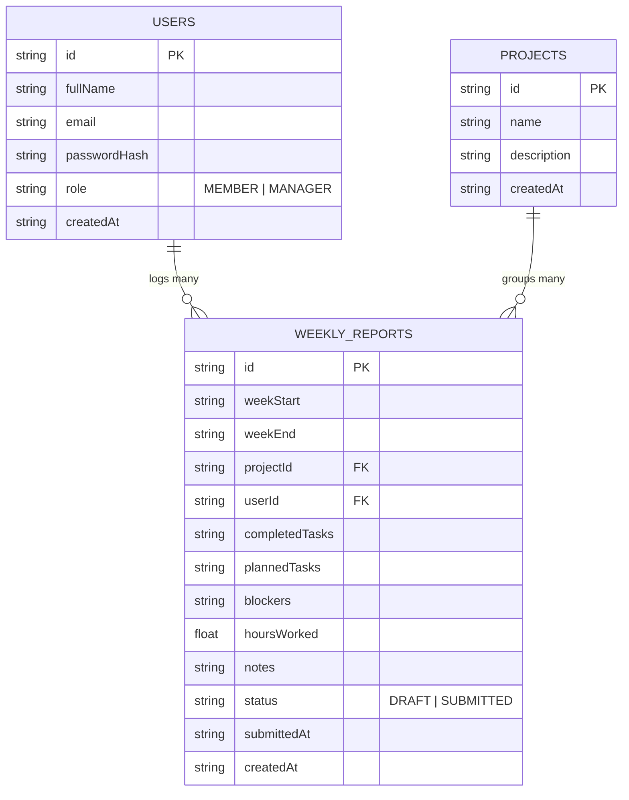

# TeamSync - Weekly Report Generator & Team Dashboard

TeamSync is a full-stack web application for structured weekly reporting, team performance tracking, and managerial analytics. It enables team members to submit standardized weekly reports while providing managers with a centralized dashboard for monitoring progress, workload distribution, and submission compliance.

## Features
##  Team Member
Create weekly reports (structured fixed format)
Edit and update draft reports
Submit finalized reports
View personal report history
Track weekly progress

##  Manager / Admin
View all team reports
Filter by user, project, or date range
Monitor submission status (Draft / Submitted / Late)
Analyze team performance through dashboards
View workload distribution across projects

## Dashboard & Analytics
Total reports submitted per week
Submission compliance rate
Open blockers across team
Task completion trends
Project-wise workload distribution
Activity feed of recent reports

## Project Management
Create / update / delete projects
Assign reports to projects
Organize work by categories

## AI Assistant (Optional Feature)
Chat-based team insights
Automated weekly summaries
Blocker detection and workload analysis


##  Tech Stack

### Frontend
React 19 + Vite
React Router DOM
Tailwind CSS
Recharts (data visualization)
Lucide React (icons)
Context API (auth state management)

### Backend
Node.js + Express
TypeScript
Zod (validation layer)
JWT Authentication
bcryptjs (password hashing)
Neon database (development)

## AI Integration
Google Gemini API (AI-powered insights & summaries)


##  Folder Structure

# Project Structure

```
├── assets
├── src
│   ├── assets
│   │   └── images
│   │       └── teamsync_logo_1783418967511.jpg
│   ├── components
│   │   ├── Footer.tsx
│   │   ├── Navbar.tsx
│   │   ├── ProtectedRoute.tsx
│   │   ├── RoleGuard.tsx
│   │   └── Sidebar.tsx
│   ├── context
│   │   └── AuthContext.tsx
│   ├── db
│   │   ├── index.ts
│   │   └── schema.ts
│   ├── pages
│   │   ├── AIAssistant.tsx
│   │   ├── CreateReportPage.tsx
│   │   ├── Dashboard.tsx
│   │   ├── EditReportPage.tsx
│   │   ├── LandingPage.tsx
│   │   ├── Login.tsx
│   │   ├── NotFoundPage.tsx
│   │   ├── ProfilePage.tsx
│   │   ├── ProjectsPage.tsx
│   │   ├── Register.tsx
│   │   ├── ReportsPage.tsx
│   │   └── UnauthorizedPage.tsx
│   ├── server
│   │   ├── db.json
│   │   └── db.ts
│   ├── App.tsx
│   ├── index.css
│   ├── loadEnv.ts
│   ├── main.tsx
│   ├── types.ts
│   └── vite-env.d.ts
├── .env.example
├── drizzle.config.ts
├── index.html
├── metadata.json
├── package-lock.json
├── package.json
├── README.md
├── server.ts
├── tsconfig.json
└── vite.config.ts
```


##  Database ER Diagram



---

##  Security Operations
- **Password Hashing**: Direct hashing using `bcryptjs` with standard salts.
- **JWT Protection**: Tokens signed on the backend via `jsonwebtoken` and parsed during client interceptors.
- **Role-Based Guards**: Rigorous validation on endpoints ensuring members can only delete/edit their own **Draft** reports.

---

## Quick Demo Credentials
To evaluate immediately, use these preloaded accounts:
- **Manager Account**:
  - **Email**: `sarah@company.com`
  - **Password**: `admin123`
- **Team Member Account**:
  - **Email**: `john@company.com`
  - **Password**: `user123`
